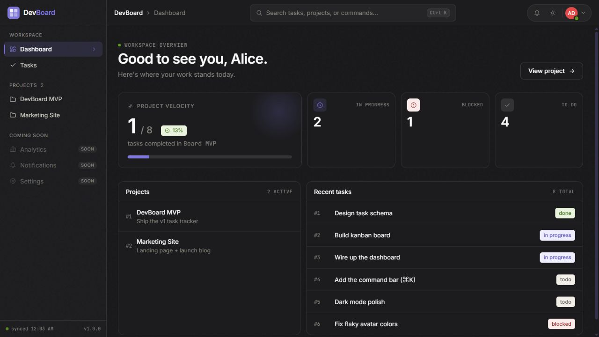
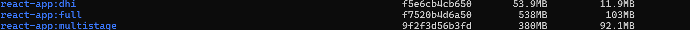
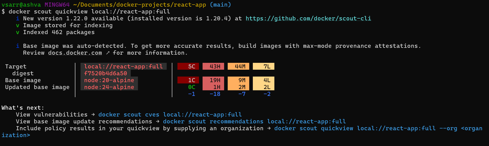
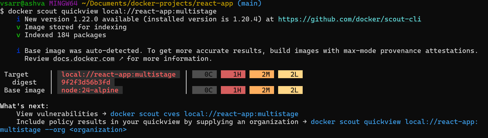
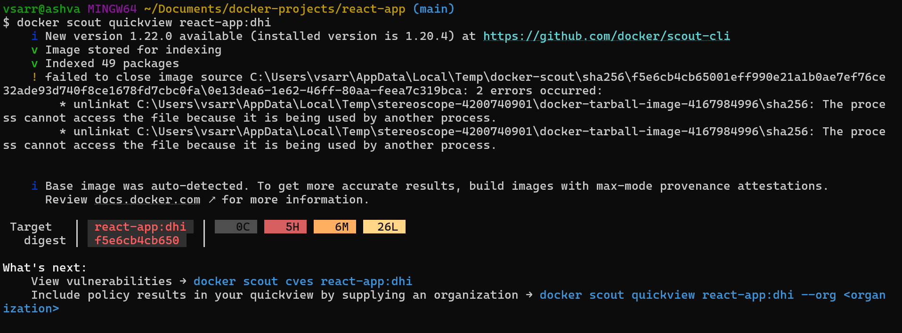
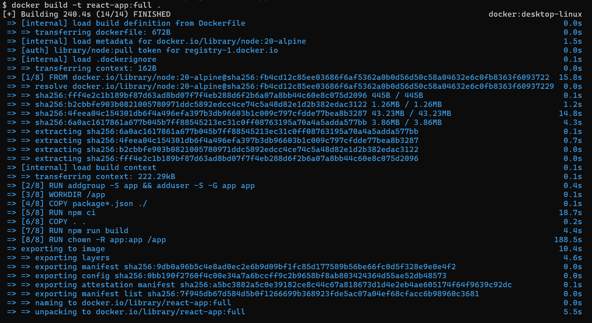
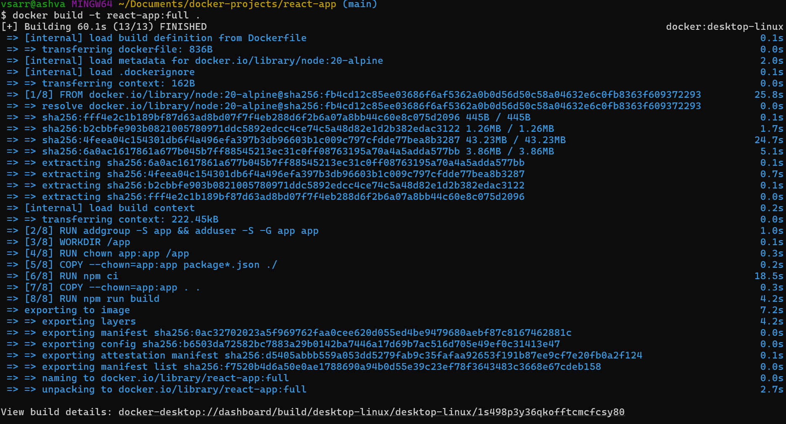

<div align="center">
  
  <h1>DevBoard</h1>
  <p><strong>Secure-by-default container delivery for a React task board.</strong></p>
  <p>
    <a href="https://github.com/vizzz40/cicd-hardened-dockerized-react-app/actions/workflows/ci.yml"></a>
    
    
    
  </p>
</div>



> [!NOTE]
> CI is implemented and reproducible. Image publishing, provenance signing, and deployment remain intentionally listed as CD milestones rather than being presented as finished work.

## Why this project exists

This repository turns a React application into a verifiable DevSecOps exercise: reduce the runtime attack surface, run without root, test the built container, and fail pull requests when security checks detect unacceptable risk.

- **Minimal runtime** — the final image contains compiled assets and NGINX, not Node.js, source files, npm caches, or development dependencies.
- **Secure defaults** — the shell-free Chainguard runtime starts as UID `65532` and exposes only port `8080`.
- **Reproducible builds** — `npm ci`, a lockfile, isolated build stages, and BuildKit caches keep builds deterministic and fast.
- **Security gates** — Gitleaks scans Git history; Trivy blocks fixable high or critical runtime findings.
- **Runtime verification** — CI asserts the image user, starts the exact built image, and checks `/healthz` before scanning it.

## Verified snapshot

Validated locally on **18 August 2026** using the default `Dockerfile`:

| Check | Result |
| --- | --- |
| Production image size | **7.65 MB** |
| Docker Scout runtime findings | **0 critical · 0 high · 0 medium · 0 low** |
| Container identity | **UID 65532** |
| Health endpoint | **HTTP 200** from `/healthz` |
| Test suite | **25/25 passing** |

Scanner databases and mutable base-image tags change over time. The CI result is the current source of truth; this table records one dated, reproducible snapshot.

## Image-hardening experiment

The project was developed through three earlier runtime variants. These results are observed scans preserved as evidence, not synthetic estimates.

| Variant | Image size | Critical | High | Medium | Low |
| --- | ---: | ---: | ---: | ---: | ---: |
| Full Node runtime | 538 MB | 5 | 43 | 44 | 7 |
| Multi-stage Node runtime | 380 MB | 0 | 1 | 2 | 2 |
| NGINX Docker Hardened Image | 53.9 MB | 0 | 5 | 6 | 26 |

The DHI experiment cut image size by about **90%**, removed all **5 critical findings**, and reduced high findings from **43 to 5**. The multi-stage Node scan had fewer total findings than the DHI scan in this snapshot, so the raw counts are shown instead of claiming one image is universally safer.

The ownership optimization also reduced one observed clean build from **240.4 s to 60.1 s** by replacing a recursive `chown` with ownership applied during `COPY`. Timing varies by hardware, network, and cache state; this is a recorded run, not a controlled benchmark.



<details>
<summary><strong>View Docker Scout comparison screenshots</strong></summary>

### Original full image



### Multi-stage image



### Docker Hardened Image



</details>

<details>
<summary><strong>View build-time screenshots</strong></summary>

### Before ownership optimization



### After ownership optimization



</details>

## Delivery architecture

```text
React + Vite source
        |
        v
Node 24 build stage ---- npm ci + Vite production build
        |
        v
Compiled /dist assets only
        |
        v
Chainguard NGINX ---- UID 65532 + port 8080 + /healthz
```

The default `Dockerfile` is the deployable path. `Dockerfile.multistage`, `Dockerfile.dhi`, and `Dockerfile-node.dhi` preserve earlier hardening experiments. The DHI variants require access to `dhi.io`.

## CI pipeline

Every push and pull request targeting `main` runs three paths:

1. Install locked dependencies, run the Vitest suite, and create the production bundle.
2. Scan the complete Git history with Gitleaks for committed secrets.
3. Build the production image, verify its non-root user and `/healthz` endpoint, and run a blocking Trivy scan.

The workflow uses read-only repository permissions, job timeouts, concurrency cancellation, and GitHub Actions BuildKit caching. See [the workflow](.github/workflows/ci.yml).

## Run locally

```bash
docker build -t devboard:local .
docker run --rm -p 8080:8080 devboard:local
curl --fail http://localhost:8080/healthz
```

For application development:

```bash
npm ci
npm test
npm run dev
```

## Scope and next steps

The interface uses mock data so this repository stays focused on container engineering and software supply-chain controls.

- Publish immutable image tags to a container registry
- Generate and attach an SBOM and SLSA provenance
- Sign images with keyless Cosign
- Deploy through an environment-protected release job
